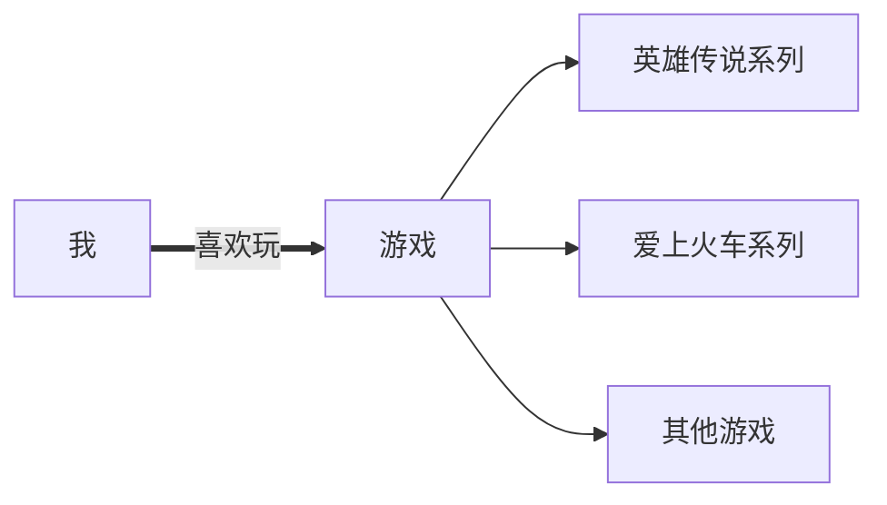


**你好，欢迎访问我的博客。**
听说你也是一个广♂door人，所以我们可能是老乡。


# 关于我

我是一个普通的学生，喜欢 ，目前~~初中在读~~已经初中毕业了。

我不会写代码，来打我啊。（逃）

吐槽一下，这栋楼的电路有问题，天天停电检修，两三个月也没修好……今天  甚至还起火了，幸好没有人员伤亡。

## 喜欢的东西

### 游戏

<!--
- 英雄传说系列
    - 空之轨迹系列
        - 英雄传说（6）：空之轨迹FC
        - 英雄传说：空之轨迹SC
        - 英雄传说：空之轨迹the 3rd
    - 零/碧之轨迹系列
        - 英雄传说：零之轨迹
        - 英雄传说：碧之轨迹
    - 闪/创之轨迹系列
        - 英雄传说：闪之轨迹I
        - 英雄传说：闪之轨迹II
        - 英雄传说：闪之轨迹III
        - 英雄传说：闪之轨迹IX
        - 英雄传说：创之轨迹
    - ……

- 爱上火车系列
    - 爱上火车-Pure Station-
    - 爱上火车-Last Run!!-

- Mirror 系列
    - Mirror
    - Mirror 2: Project X

- ……
-->

### 番剧

看过 *11-4-5+1-4* 集。

# 关于博客

早在 2018 年就有“弄个博客写点东西什么的吧”之类的想法，但是懒（笑）。

这个博客经历过 3 次重写，具体的就不说了。

## 你可从以下网址访问我的博客

**注意**：如果网址后面**没有绿色对勾**，则该网址可能无法访问。

- Github Pages
    - https://savfile.github.io 

- Gitlab Pages
    - https://savfile.gitlab.io 

- Vercel
    - https://savfile.vercel.app 
    - https://blog-savfile.vercel.app 
    - https://savfile-blog.vercel.app 

- Netlify
    - https://savfile.netlify.app 

<!--
- Bitbucket Cloud
    - https://savfile.bitbucket.io 
-->

-  Cloudflare Pages
    - https://savfile.pages.dev 
    - https://savfile-blog.pages.dev 

<!--
- Gitee Pages
    - https://savfile.gitee.io 
-->

# 准备做的事

- [ ] 简单学吹一下口琴。
- [ ] 随便学学编程。
- [ ] 学完《中日交流标准日本语》旧版（新版也可）初级。
- [ ] 买点游戏和周边。
- [ ] （让我想想先）
